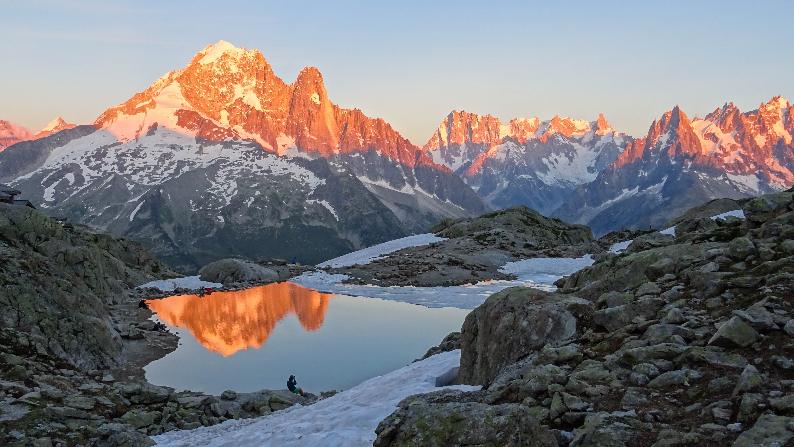
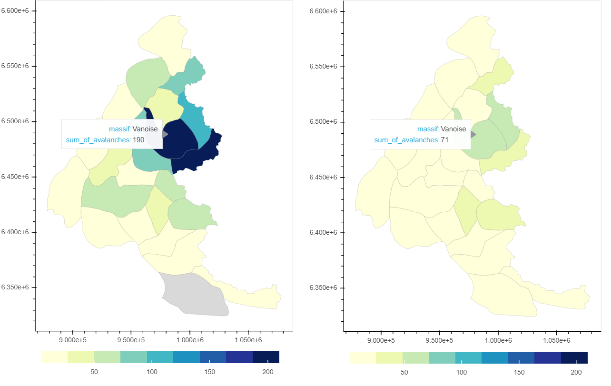

# Avalanche prediction for 22 massifs of French Alps

## by Kamila Hamalcikova

View on Mont Blanc massif from Lac Blanc during sunrise, source: Kamila Hamalcikova

## Dataset

My dataset is compilation of 3 sources:
- 1) multiple Excel and pdf reports about occurence of avalanche accidents in France from winter season 2010/11 till 2019/20. Original reports can be found on [ANENA (Association Nationale pour l’Étude de la Neige et des Avalanches)](https://www.anena.org/5041-bilan-des-accidents.htm) website.
- 2) Excel report about avalanche events from [Data-avalanche.org](http://www.data-avalanche.org/)
- 3) netCDF4 files and shapefiles for various meteo and snow variables from [The S2M meteorological and snow cover reanalysis in the French mountainous areas (1958 - present)](https://en.aeris-data.fr/metadata/?865730e8-edeb-4c6b-ae58-80f95166509b)

## Installation

- Anaconda
- Jupyter Notebook
- Python 3.6
- Python libraries (Pandas, Numpy, Geopandas, Scikit-Learn, Bokeh, Matplotlib,
    Seaborn, Glob, Json, Datetime, Pathlib, NetCDF4, Xarray)
- Flask

## Main findings

- Data exploration: Avalanche accidents (with people injured,dead or in need of rescue team) and avalanche events (natural events where people might or might not be involved) are most frequent in March, in altitude from 2000 to 3000 metres. Avalanche accidents happen most often to groups of 2 people while hiking. Avalanche accidents happen most in Vanoise massif, while avalanche events were most frequent in Haute Maurienne massif.

image of avalanche events (left) and avalanche accidents (right) on the map of French Alps, source: Kamila Hamalcikova/Bokeh

- Avalanche prediction with machine learning: Random Forest (RF) was machine learning model used for prediction of avalanche events and accidents. Model did provide very good performance when undersampling was used (sample divided in 50 % od cas with avalanche and 50 % without avalanche). However, when RF model was used on normal sample where we have very **imbalanced data due to very low number of days with avalanches**, it returned very **good results for weighted F1-score; 0.998 for avalanche events and 0.995 for avalanche accidents, but recall for days with avalanches was not very satisfying, especially for avalanche accidents**. Recall for days without avalanche events or accident was 1, so perfect, but recall for days with avalanche event was 0.55 and 0.44 for avalanche accident.

## How to run the code

- Data exploration: in files avalanche_events_EDA.ipynb and avalanche_accidents_EDA.ipynb, or png.images can be displayed without checking ipynb files.

- Avalanche prediction with machine learning: In order to repeat data wrangling of my final dataset, you need to download source nc files from The S2M meteorological and snow cover reanalysis (link above) and then run folowwing files in this order:
    1) scripts in **year_select.py** and **one_year_meteo.py** to get data about meteo variables into csv files for different years
    2) **snow_variables.ipynb** to get data about snow variables into csv file, **meteo_variables.ipynb** to get data about meteo variables into final csv file and merge it with snow variables data
    3) **final_merge.ipynb** to get final dataset for machine learning
    4) **random_forest_avalanche_events.ipynb** and **random_forest_avalanche_accidents.ipynb** to get results of Random Forest model

- Flask app: in folder Flask app

## License

This project is licensed under the MIT License - see the [license](https://opensource.org/licenses/MIT) file for details

## Sources

- [ANENA - for avalanche accidents reports](https://www.anena.org/5041-bilan-des-accidents.htm#par42276)
- [The S2M meteorological and snow cover reanalysis in the French mountainous areas (1958 - present) - for snow and meteo variables](https://en.aeris-data.fr/metadata/?865730e8-edeb-4c6b-ae58-80f95166509b)
- [Data-avalanche.org - for avalanche events reports](http://www.data-avalanche.org/)
- [Bagging and Random Forest for Imbalanced Classification](https://machinelearningmastery.com/bagging-and-random-forest-for-imbalanced-classification/)
- [Growing RForest - 97% Recall and 100% Precision](https://www.kaggle.com/palmbook/growing-rforest-97-recall-and-100-precision)
- [Implementing a Random Forest Classification Model in Python](https://medium.com/@hjhuney/implementing-a-random-forest-classification-model-in-python-583891c99652)
- [Adding CSS styling to your website](https://pythonhow.com/add-css-to-flask-website/)
- [Build a Python Web Server with Flask](https://projects.raspberrypi.org/en/projects/python-web-server-with-flask)
